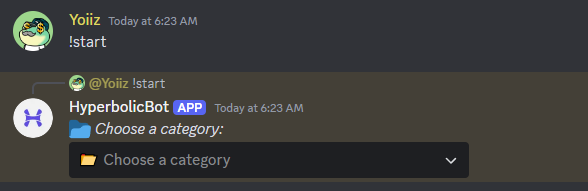
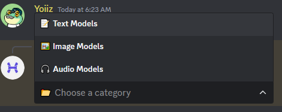
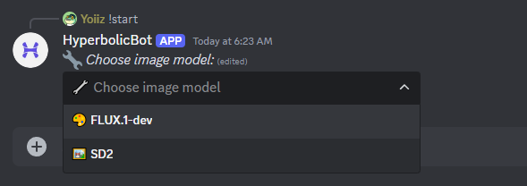
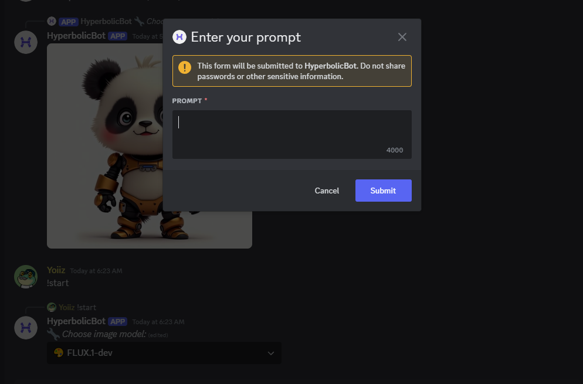
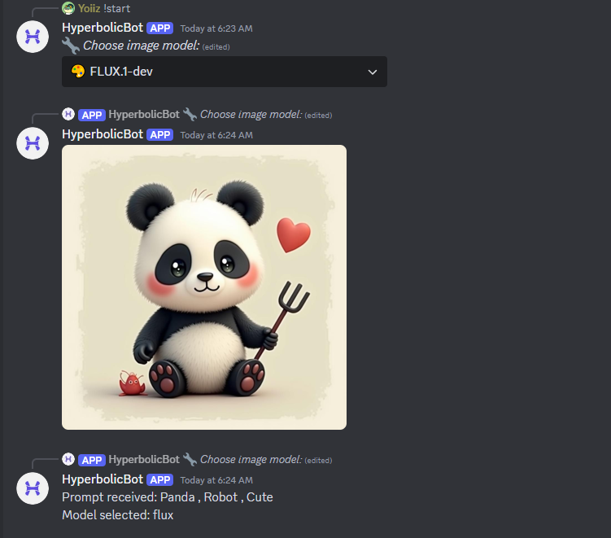

# Hyperbolic Discord bot Project

This project is a Hyperbolic Discord bot that interacts with users to provide various functionalities, including model selection and Hyperbolic API integration. The bot is built using the Discord.js library and is designed to handle commands and events efficiently.

## 📚 Features
- **Multi-Model Support**:
  - 📝 Text Generation (4 models)
  - 🖼️ Image Generation (2 models)
  - 🔊 Audio Synthesis (1 model)
 
## Project Structure

```
Hyperbolic-Discord-Bot
├── src
│   ├── bot.js                # Entry point for the Discord bot
│   ├── commands              # Command handlers for the bot
│   │   ├── help.js           # Help command
│   │   ├── remove.js         # Command to remove user data
│   │   ├── start.js          # Command to start the bot session
│   │   └── switch.js         # Command to switch models
│   ├── handlers              # Handlers for commands and events
│   │   ├── commandHandler.js  # Command processing logic
│   │   └── eventHandler.js    # Event handling logic
│   ├── models.js             # Model definitions and configurations
│   └── utils                 # Utility functions
│       └── api.js            # API call utilities
├── package.json              # NPM configuration file
├── .env                      # Environment variables
└── README.md                 # Project documentation
```

## Setup Instructions

### Prerequisites

- Node.js (v14 or higher)
- npm (v6 or higher)
- A Discord account
- A Discord bot token
- Hyperbolic API keys for the models you intend to use

### Step-by-Step Guide

1. **Clone the repository:**
   ```bash
   git clone https://github.com/zunxbt/hyperbolic-bot.git
   cd Hyperbolic-Discord-Bot
   ```

2. **Install dependencies:**
   ```bash
   npm install
   ```

3. **Create a Discord Bot and Get DISCORD_BOT_TOKEN:**

   - Go to the Discord Developer Portal [https://discord.com/developers/applications].
   - Click on "New Application" and give your bot a name.
   - Navigate to the "Bot" tab and click "Add Bot".
   - Copy the bot token and save it for later.
   - Navigate to the "OAuth2" tab and select "URL Generator".
   - Under "OAuth2 URL Generator", select the "bot" scope and the "Administrator" permission.
   - Copy the generated URL and use it to invite the bot to your server.

4. **Create a Hyperbolic Account and Get HYPERBOLIC_API_KEY:**
   - Go to Hyperbolic Website  [https://app.hyperbolic.xyz/] .
   - Sign up 
   - Navigate to the "settings" tab
   - Copy the API Key and save it for later.

5. **Set up environment variables:**
   - Copy the `.env.example` file to `.env` and fill in the required environment variables, including your Discord bot token (DISCORD_BOT_TOKEN) and Hyperbolic API key (HYPERBOLIC_API_KEY):
   ```
   DISCORD_BOT_TOKEN=your-discord-bot-token
   HYPERBOLIC_API_KEY=your-hyperbolic-api-key
   ```

6. **Run the bot:**
   ```bash
   node src/bot.js
   ```

## Usage

- Use the following commands to interact with the bot:
  - `!start` - Initialize the bot session.
  - `!help` - Get a list of available commands and their usage.

## Example 






## Contributing

Feel free to submit issues or pull requests to improve the bot's functionality or documentation.

## Additional Information
- Discord.js Documentation: https://discord.js.org
- Discord Developer Portal: https://discord.com/developers/applications
- Node.js Download: https://nodejs.org

By following these instructions, you should be able to set up and run your Hyperbolic Discord bot successfully. If you encounter any issues, please refer to the documentation or open an issue on the repository.
